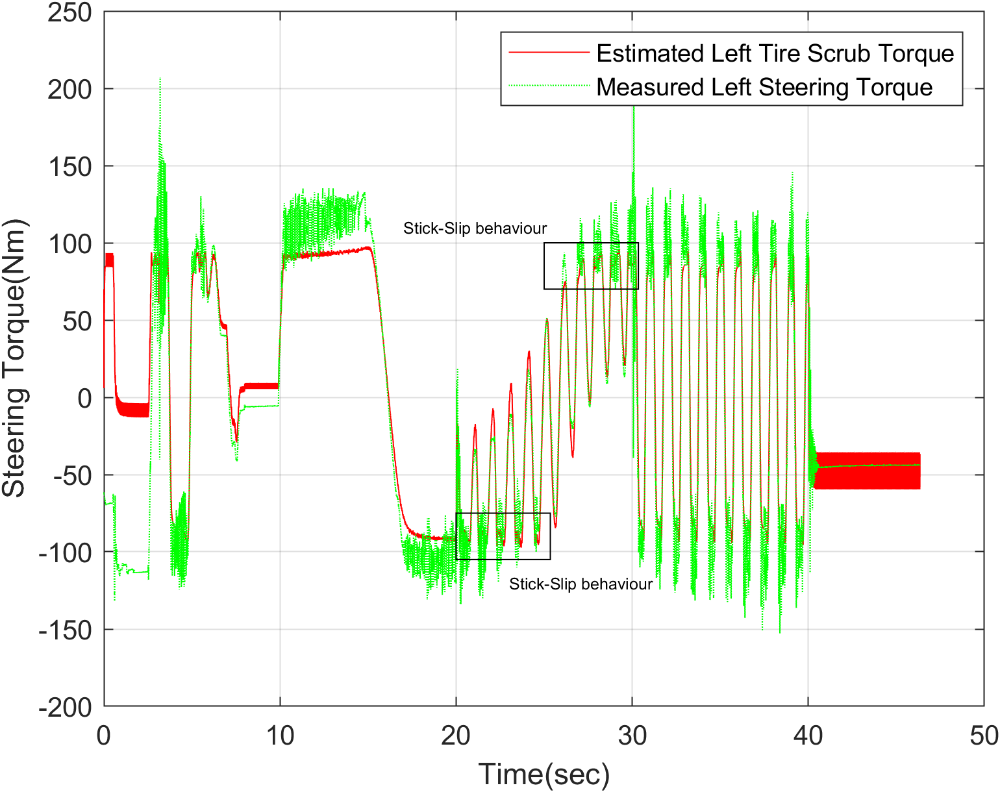

# Tire Scrub Torque Estimation Based on a Tire Brush Model

Tire scrub torque is the torque generated at the tire contact patch due to lateral or 
longitudinal slip when the tire interacts with the road surface. It arises from the 
deformation and frictional forces within the contact patch as the tire resists motion. The contact patch is the area of the tire which interact with the road surface.
This torque provides insight into the tire-road friction characteristics, especially during 
low-speed or stationary conditions. The tire scrub torque of a stationary vehicle under steering excitation can be effectively modeled using the tire brush model.

Video 1: Evaluation of tire contact patch brush group due to the friction (i.e. Sliding and Adhesive friction) and non-linear stick slip behaviour

## Tire Brush Model

In the tire brush model, the tire tread is represented by numerous flexible bristles, i.e., brushes, that are attached to the tire belt. 
These bristles simulate the way the tread interacts with the road. The tire carcass provides structural support to both 
the tread and the bristles. In the most conventional brush models, the carcass is assumed to be rigid, simplifying the overall analysis. 
The interaction between the flexibility of these components determines the tires overall elasticity. \cite{bib:Pacejkabook}

When a vehicle is kept stationary and the tire is turned, it induces steering force $F_y$ at the
leading edge and the counteracting force $-F_y$ at the trailing edge in the opposite direction. The brushes in the contact
patch undergo lateral deformation due to the imposed steering angle. At first, all brushes adhere to the ground, 
meaning their deformation is purely elastic. The edges of the contact patch begins to deform as the steering angle is applied. 
Tire stiffness resists this deformation, while friction opposes relative motion between the brushes and the road. As the steering angle increases, 
this deformation progresses further into the contact patch, moving from the edge toward the center of rotation. The lateral displacement 
of the brushes increases, and eventually, the edges may reach its friction limit and begin to slide. This sliding then progresses 
through the contact patch as the deformation exceeds the available friction, causing parts of the contact patch to enter a sliding state and 
reducing the tires' ability to generate lateral force effectively. This leads to two separate regions of the contact patch, sliding and the adhesion region, as shown in the *Figure 1*. 
<!-- (\cite{bib:Pacejkabook,bib:Beal2020Friction}) -->

Figure 1: A single row of brushes deflection under steering force $F_y$

The transition points mark the boundary between the adhesion and sliding regions in the tire contact patch. In the adhesion region, the adhesive friction force 
$F_y \mu_{ad}$ is significantly higher than the sliding friction force $F_y \mu_{s}$. This dominance of the adhesive friction force causes the brushes to remain firmly attached to the ground, resisting lateral motion. However, as lateral forces increases, the brushes experience *stick-slip behavior*, 
where they intermittently adhere to the surface and then slide near the frictional limit.
This stick-slip behavior occurs near to the transition point. Also, the transition point is not fixed; it varies based on the intensity of the steering force $F_y$ 
on the tire conatct patch. Beyond the transition point, in the sliding region, the frictional interaction is dominated by the sliding friction force 
$F_y\mu_{s}$ or $-F_y\mu_{s}$, causing the brushes to lose adhesion and slide rather than deform elastically. This shift in behavior significantly influences the generation of lateral force. [(1,2)]

It is important to note that the steering force $F_y$ is subject to losses. Such as backlash and mechanical friction, before it reaches the tire contact patch. Moreover, the majority of $F_y$ is primarily used to overcome the friction between the tire and the road surface.

## Model Fitting

The mathematical formulation used in this project is well described in [2]. However, certain modifications were made to achieve more accurate behavior. For example, the use of sliding window integration significantly reduced the integration error over the entire time frame. Moreover, the measured steering torque data is available without the influence of the jacking effect. The jacking effect refers to vertical forces or moments generated during steering due to the suspension geometry. This means the measured steering torque 
is a tire scrub torque with other residual components.

Figure 2: Model comparison with measured data

The *Figure 2* presents the steering torque data used to compare the behavior of the models. The data was collected while the vehicle was on dry concrete, as described in [2]. The fluctuations in the estimated tire scrub torque within the highlighted rectangular area represent stick-slip behavior. This demonstrates the model’s accuracy in capturing the tire–road interaction.

The model does not account for certain aspects of the tire torque data, particularly the hysteresis 
effects of the steering linkage. Moreover, Fully characterizing this backlash and compliance of the steering
system would require costly testing and specialized equipment. Consequently, these effects are omitted from the model.

## Software Requirements

MATLAB 2021b and higher version recommended.

## Licence

**Tire Scrub Torque Estimation Based on Tire Brush Model** © 2025 by *Mohammadaadil Shaikh*  
is licensed under the [Creative Commons Attribution-NonCommercial 4.0 International License (CC BY-NC 4.0)](https://creativecommons.org/licenses/by-nc/4.0/).

You are free to use, modify, and share this work for **non-commercial purposes**, as long as proper credit is given.

## Bibliography
[1] Pacejka, Hans. Tire and vehicle dynamics. Elsevier, 2005.

[2] Beal, Craig E., and Sean Brennan. "Friction detection from stationary steering manoeuvres." Vehicle System Dynamics 58.11 (2020): 1736-1765.
